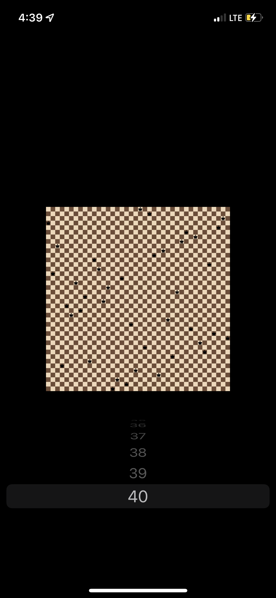

# IOS App for solving N-queens puzzle

## Installation 
Для запуска на симуляторе необходимо установить [ios-sim]("https://github.com/ios-control/ios-sim"):
```bash
npm install -g ios-sim
```
Для запуска на устройстве нужен IOS выше 14-ого. 

Далее сбилдить проект с помощью `xcodebuild`:
```bash
xcodebuild -scheme EightQueensPuzzle build
```

После этого запустить `ios-sim`. Подпись там будет понятно какая, можно просто посмотреть, какая папка есть с таким префиксом:
```bash
ios-sim launch /Users/{$USER}/Library/Developer/Xcode/DerivedData/EightQueensPuzzle-{$SIGNATURE}/Build/Products/Debug-iphonesimulator/EightQueensPuzzle.app
```


## Screenshots:
Поддерживает N от 4 до 40, дальше уже клетки совсем уж маленькими становятся. 

* Для доски размера 8 на 8:
  
* Для доски размера 22 на 22:
  
* Для доски размера 40 на 40:
  
